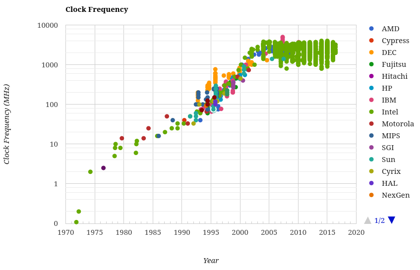

# Введение

Суть высокопроизводительного программирования в написании наиболее эффективного кода - минимизации переноса и обработки данных за счет сокращения накладных расходов ресурсов или изменения способа проведения операции.

Высокая производительность обеспечивается не только алгоритмами, но и учетом особенностей архитектуры компьютера или языка.

## Архитектура компьютера

В основе компьютера, грубо говоря, лежат три вещи: блок вычислений, блок памяти и коммуникация между ними.

Например, можно думать о компьютере как о центральном процессоре (блок вычислений), соединенным с оперативной памятью и жестким диском (блок памяти), и шине (коммуникация), которая является связующим звеном.

Это упрощенная модель. В реальности в самом ЦП существуют блоки памяти в виде L1, L2 кэшей (а иногда и L3 и L4).

Углубимся в каждый блок.

### Блок вычислений

Помимо ЦП в качестве блока вычислений можно использовать и ГП - графические процессоры. Наиболее важные характеристики блока вычислений:

1. Количество инструкций, выполняемых в рамках одного цикла (_IPC_)
2. Количество циклов в секунду

**Векторизация** подразумевает под собой возможность манипулировать множеством данных одновременно. Такой тип инструкций ЦП называется SIMD (single instruction, multiple data).

Динамика изменения характеристик ЦП за последние годы уже не такая впечатляющая, о чем свидетельствует [график](http://cpudb.stanford.edu/visualize/clock_frequency):



Все упирается в физические ограничения размера транзистора.

Hyperthreading предоставляет виртуальный дополнительный вычислительный блок в рамках одного ЦП. Такой подход может дать преимущество до 30% над однопоточной программой.

С помощью многопоточности можно запускать независимые части кода. Однако это может сделать написание кода более сложным занятием.

Многоядерная архитектура позволяет распараллеливать вычисления, что может повысить скорость работы, однако добавления большего количества ядер не всегда это позволит сделать по закону Амдала:

> ускорение выполнения программы за счёт распараллеливания её инструкций на множестве вычислителей ограничено временем, необходимым для выполнения её последовательных инструкций

Если стоит задача опросить 100 людей, то, при условии 1 человек = 1 минута, это займет 100 минут. Если опрашивать одновременно 2 человека, то уже займет всего 50 минут. Добавляя больше "опрашивателей", мы увеличим скорость, но все равно упремся в 1 минуту.

#### GIL
**GIL** - global interpreter lock. Эта технология дает уверенность в том, что процесс в Python выполняет одну инструкцию в конкретный момент времени, несмотря на количество ядер. Если следовать примеру выше, то сколько бы ни было "опрашивателей", один процесс сможет опросить только 1 человека в минуту.

Эта проблема решается с помощью встроенной библиотеки _multiprocessing_, технологиями _numpy_ или _numexpr_, _Cython_ или распределенными моделями вычислений.

### Блок памяти

Память характеризуется скоростью емкостью и скоростью чтения/записи.

В дополнение к это скорости есть еще задержка - время поиска нужного участка памяти. Для жестких дисков этот показатель высок, потому что ему нужно физически прокрутиться и переместить голову в нужную позицию.

Некоторые типы памяти:

1. HDD. Долговременная память. Медленная, зато очень емкая. (~10 ТБ)
2. SSD. Схоже с HDD, но более быстрая и менее емкая. (ТБ)
3. RAM. Используется для хранения кода и данных. Использует произвольный доступ. Еще более быстрая и менее емкая. (~64 ГБ)
4. L1/L2 кэш. Очень быстрая, но маленькая. Данные, идущие в ЦП, обязаны пройти через эту память. (МБ)

За скорость приходится платить памятью и наоборот.

### Коммуникация

Возьмем, например, _frontside bus_ - шину, соединяющую RAM и L1/L2 кэш. Она перемещает готовые к изменению процессором данные и полученный результаты вычислений.

Главной характеристикой шины является ее скорость - сколько данных она способна переместить за заданный промежуток времени. Скорость, в свою очередь, зависит от двух показателей:

1. bus width - сколько данных шина может передать за одно перемещение.
2. bus frequency - сколько перемещений шина может совершить за секунду.

Большой показатель bus width позволяет осуществлять векторизацию, а высокая частота позволяет многократно читать из памяти произвольного доступа.

## Виртуальная машина Python

Нам не нужно заботиться о выделении памяти, о хранении массивов в памяти, в какой последовательности все отправляется в ЦП. Это позволяет сфокусироваться на алгоритмах, но приходится платить производительностью.

В коде ниже понятно, что `search_fast` работает быстрее `search_slow`, потому что он не тратит время на ненужные операции.

```python
def search_fast(haystack, needle):
    for item in haystack:
        if item == needle:
            return True
    return False


def search_slow(haystack, needle):
    return_value = False
    for item in haystack:
        if item == needle:
            return_value = True
    return return_value


def search_unknown1(haystack, needle):
    return any((item == needle for item in haystack))


def search_unknown2(haystack, needle):
    return any([item == needle for item in haystack])
```

А как насчет `search_unknown1` и `search_unknown2`? На первый взгляд, отличия незначительные, но по факту:

```ipython
In [15]: haystack, needle = list(range(100_000)), 87_500

In [16]: %timeit search_unknown1(haystack, needle)
3 ms ± 75 µs per loop (mean ± std. dev. of 7 runs, 100 loops each)

In [17]: %timeit search_unknown2(haystack, needle)
2.68 ms ± 101 µs per loop (mean ± std. dev. of 7 runs, 100 loops each)
```

### Важные особенности ВМ:

- Объекты хранятся в памяти не оптимальным способом, поэтому шина передает не всегда все нужные данные за раз.
- Динамическая типизация не дает оптимизировать существующий код. Компиляторы зачастую умнее человека, поэтому компилируемые языки более производительны.
- GIL ударяет по производительности при попытке распараллелить вычисления. Например, для вычисления простого числа могло бы понадобиться sqrtN / M операций на каждое из M ядер, однако работать может только одно ядро.

## Подход к решению задач
#### Make it work
Решаем поставленную задачу.
#### Make it right
Убеждаемся в корректности решения, покрывая тестами.
#### Make it fast
Фокусируемся на профилировании и оптимизации решения.
