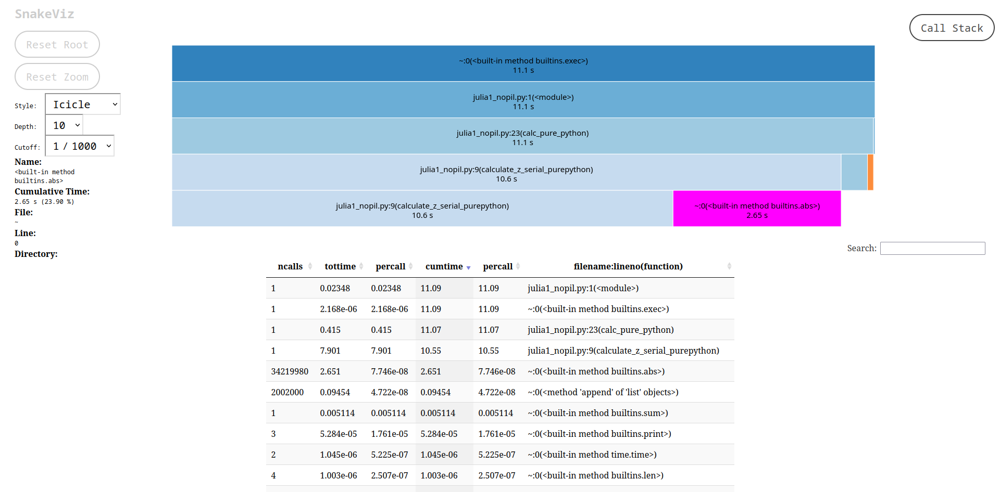
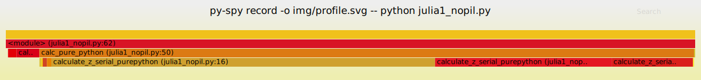

# Профилирование

### Декоратор измерения времени работы

```python
import time
from functools import wraps

def timefn(fn):
    @wraps(fn)
    def measure_time(*args, **kwargs):
        t1 = time.time()
        result = fn(*args, **kwargs)
        t2 = time.time()
        print(f"@timefn: {fn.__name__} took {t2 - t1} seconds")
        return result
    return measure_time


@timefn
def calculate_z_serial_purepython(maxiter, zs, cs):
    ...
```

### timeit, командная строка

```shell
$ python -m timeit -n 5 -r 1 -s "import julia1" \
"julia1.calc_pure_python(desired_width=1000, max_iterations=300)"
```

```
5 loops, best of 1: 5.17 sec per loop
```

| Опция              | Пояснение                                                        |
|--------------------|------------------------------------------------------------------|
| -n 5               | Количество запусков кода                                         |
| -r 5               | Количество повторений эксперимента (1 r = 5 n)                   |
| -s "import julia1" | Настройка эксперимента перед исполнением кода. Вызывается 1 раз. |

По умолчанию `-n 10 -r 5`

### timeit, IPython

В интерактивном режиме удобно пользоваться magic-командой %timeit

```shell
$ ipython
```

```ipython
In [1]: import julia1

In [2]: %timeit julia1.calc_pure_python(desired_width=1000, max_iterations=300)
```

```
5.77 s ± 406 ms per loop (mean ± std. dev. of 7 runs, 1 loop each)
```

`timeit.py` использует минимальное значение<br>
`%timeit` использует среднее время и стандартное отклонение

### Unix-утилита time

```shell
$ /usr/bin/time -p python julia1_nopil.py 
```
```
Length of x: 1000
Total elements: 1000000
calculate_z_serial_purepython took 5.151060104370117 seconds
real 5.45
user 5.42
sys 0.02
```

Используется `/usr/bin/time` вместо `time` используется намеренно, чтобы получить именно системную утилиту, а не упрощенную версию из командной оболочки.

Флаг `-p` позволяет получить три значения:

- `real` полное затраченное время
- `user` время, затраченное ЦПУ на исполнение задачи вне ядра
- `sys` время на исполнение функций ядра

Разница между `real` и `user` может указать на `%IO` - ожидание ввода/вывода, а также насколько система загружена другими задачами.

`time` - очень полезная утилита, потому что она не привязана к Python. Хорошо подходит для коротких по времени исполнения программ. 

Можно получить гораздо больше информации, добавив флаг `-v` или `--verbose`:

```shell
$ /usr/bin/time -v python julia1_nopil.py
```
```
Length of x: 1000
Total elements: 1000000
calculate_z_serial_purepython took 5.176875591278076 seconds
        Command being timed: "python julia1_nopil.py"
        User time (seconds): 5.43
        System time (seconds): 0.03
        Percent of CPU this job got: 99%
        Elapsed (wall clock) time (h:mm:ss or m:ss): 0:05.47
        Average shared text size (kbytes): 0
        Average unshared data size (kbytes): 0
        Average stack size (kbytes): 0
        Average total size (kbytes): 0
        Maximum resident set size (kbytes): 98432
        Average resident set size (kbytes): 0
        Major (requiring I/O) page faults: 0
        Minor (reclaiming a frame) page faults: 23464
        Voluntary context switches: 1
        Involuntary context switches: 22
        Swaps: 0
        File system inputs: 0
        File system outputs: 0
        Socket messages sent: 0
        Socket messages received: 0
        Signals delivered: 0
        Page size (bytes): 4096
        Exit status: 0
```

Наверное, самым полезным показателем является `Major (requiring I/O) page faults`. Он показывает, нужно ли загружать страницы данных с диска из-за того, что данные уже не хранятся в оперативной памяти. Это сильно снижает скорость работы.

### Модуль cProfile

В стандартной библиотеке есть два профилировщика: `cProfile` и `profile.profile`.

Первый написан на C и измеряет время работы в виртуальной машине CPython.<br>
Второй написан на чистом Python, поэтому он работает медленнее.

```shell
$ python -m cProfile -s cumulative julia1_nopil.py 
```
```
Length of x: 1000
Total elements: 1000000
calculate_z_serial_purepython took 10.527417659759521 seconds
         36221995 function calls in 11.142 seconds

   Ordered by: cumulative time

   ncalls  tottime  percall  cumtime  percall filename:lineno(function)
        1    0.000    0.000   11.142   11.142 {built-in method builtins.exec}
        1    0.020    0.020   11.142   11.142 julia1_nopil.py:1(<module>)
        1    0.479    0.479   11.122   11.122 julia1_nopil.py:23(calc_pure_python)
        1    7.942    7.942   10.527   10.527 julia1_nopil.py:9(calculate_z_serial_purepython)
 34219980    2.585    0.000    2.585    0.000 {built-in method builtins.abs}
  2002000    0.109    0.000    0.109    0.000 {method 'append' of 'list' objects}
        1    0.007    0.007    0.007    0.007 {built-in method builtins.sum}
        3    0.000    0.000    0.000    0.000 {built-in method builtins.print}
        2    0.000    0.000    0.000    0.000 {built-in method time.time}
        4    0.000    0.000    0.000    0.000 {built-in method builtins.len}
        1    0.000    0.000    0.000    0.000 {method 'disable' of '_lsprof.Profiler' objects}
```

Сортировка функуий по совокупному времени `-s cumulative` позволяет увидеть самые медленные части кода.

Код исполняется на 5 секунд дольше. Это плата за использование профилировщика.

Интересно, что 2.5 секунды тратится на 34219980 вызовов функции abs.

#### pstats

Чтобы лучше разобраться в результате работы cProfile, можно записать его в stat-файл, а затем проанализировать в Python:

```shell
$ python -m cProfile -o profile.stats julia1.py
```

```python
import pstats
p = pstats.Stats('profile.stats')
p.sort_stats('cumulative')
p.print_stats()
```
```
Tue Jul 26 00:28:02 2022    profile.stats

         36221995 function calls in 11.090 seconds

   Ordered by: cumulative time

   ncalls  tottime  percall  cumtime  percall filename:lineno(function)
        1    0.000    0.000   11.090   11.090 {built-in method builtins.exec}
        1    0.023    0.023   11.090   11.090 julia1_nopil.py:1(<module>)
        1    0.415    0.415   11.066   11.066 julia1_nopil.py:23(calc_pure_python)
        1    7.901    7.901   10.551   10.551 julia1_nopil.py:9(calculate_z_serial_purepython)
 34219980    2.651    0.000    2.651    0.000 {built-in method builtins.abs}
  2002000    0.095    0.000    0.095    0.000 {method 'append' of 'list' objects}
        1    0.005    0.005    0.005    0.005 {built-in method builtins.sum}
        3    0.000    0.000    0.000    0.000 {built-in method builtins.print}
        2    0.000    0.000    0.000    0.000 {built-in method time.time}
        4    0.000    0.000    0.000    0.000 {built-in method builtins.len}
        1    0.000    0.000    0.000    0.000 {method 'disable' of '_lsprof.Profiler' objects}
```

Получаем информацию о том, откуда были вызваны функции:

```python
p.print_callers()
```
```
   Ordered by: cumulative time

Function                                          was called by...
                                                      ncalls  tottime  cumtime
{built-in method builtins.exec}                   <- 
julia1_nopil.py:1(<module>)                       <-       1    0.023   11.090  {built-in method builtins.exec}
julia1_nopil.py:23(calc_pure_python)              <-       1    0.415   11.066  julia1_nopil.py:1(<module>)
julia1_nopil.py:9(calculate_z_serial_purepython)  <-       1    7.901   10.551  julia1_nopil.py:23(calc_pure_python)
{built-in method builtins.abs}                    <- 34219980    2.651    2.651  julia1_nopil.py:9(calculate_z_serial_purepython)
{method 'append' of 'list' objects}               <- 2002000    0.095    0.095  julia1_nopil.py:23(calc_pure_python)
{built-in method builtins.sum}                    <-       1    0.005    0.005  julia1_nopil.py:23(calc_pure_python)
{built-in method builtins.print}                  <-       3    0.000    0.000  julia1_nopil.py:23(calc_pure_python)
{built-in method time.time}                       <-       2    0.000    0.000  julia1_nopil.py:23(calc_pure_python)
{built-in method builtins.len}                    <-       2    0.000    0.000  julia1_nopil.py:9(calculate_z_serial_purepython)
                                                           2    0.000    0.000  julia1_nopil.py:23(calc_pure_python)
{method 'disable' of '_lsprof.Profiler' objects}  <- 
```

Кто что вызывал:

```python
p.print_callees()
```
```
   Ordered by: cumulative time

Function                                          called...
                                                      ncalls  tottime  cumtime
{built-in method builtins.exec}                   ->       1    0.023   11.090  julia1_nopil.py:1(<module>)
julia1_nopil.py:1(<module>)                       ->       1    0.415   11.066  julia1_nopil.py:23(calc_pure_python)
julia1_nopil.py:23(calc_pure_python)              ->       1    7.901   10.551  julia1_nopil.py:9(calculate_z_serial_purepython)
                                                           2    0.000    0.000  {built-in method builtins.len}
                                                           3    0.000    0.000  {built-in method builtins.print}
                                                           1    0.005    0.005  {built-in method builtins.sum}
                                                           2    0.000    0.000  {built-in method time.time}
                                                     2002000    0.095    0.095  {method 'append' of 'list' objects}
julia1_nopil.py:9(calculate_z_serial_purepython)  -> 34219980    2.651    2.651  {built-in method builtins.abs}
                                                           2    0.000    0.000  {built-in method builtins.len}
```

Не самый информативный инструмент, но позволяет быстро найти узкие места.

#### snakeviz

Файл profile.stats, полученный в результате запуска `cProfile`, можно визуализировать с помощью утилиты `snakeviz`:

```shell
$ snakeviz profile.stats
```



### line_profiler

`line_profiler` - модуль для построчного профилирования функций. `kernprof` - скрипт для запуска `line_profiler` или встроенных профилировщиков.

Каждой функции ставится декоратор `@profile`, затем запускается скрипт:

```shell
$ kernprof -l -v julia1_lineprofiler.py
```

Флаг `-l` указывает на построчное профилирование, `-v` выведет результаты в консоль, а не только в lprof-файл.

```
...
Wrote profile results to julia1_lineprofiler.py.lprof
Timer unit: 1e-06 s

Total time: 40.3695 s
File: julia1_lineprofiler.py
Function: calculate_z_serial_purepython at line 10

Line #      Hits         Time  Per Hit   % Time  Line Contents
==============================================================
    10                                           def calculate_z_serial_purepython(maxiter, zs, cs):
    11                                               """Calculate output list using Julia update rule"""
    12                                               output = [0] * len(zs)
    13         1       2625.0   2625.0      0.0      for i in range(len(zs)):
    14   1000001     306656.0      0.3      0.8          n = 0
    15   1000000     287664.0      0.3      0.7          z = zs[i]
    16   1000000     349531.0      0.3      0.9          c = cs[i]
    17   1000000     328638.0      0.3      0.8          while abs(z) < 2 and n < maxiter:
    18  34219980   15451978.0      0.5     38.3              z = z * z + c
    19  33219980   12204232.0      0.4     30.2              n += 1
    20  33219980   11086011.0      0.3     27.5          output[i] = n
    21   1000000     352194.0      0.4      0.9      return output
...
    59         1  113017245.0 113017245.0     98.4      output = calculate_z_serial_purepython(max_iterations, zs, cs)

```

Код исполняется еще дольше из-за построчных точек останова.

Самая полезная колонка - `% Time`. На 17 строчке непонятно, что обходится дороже - `abs(z) < 2` или `n < maxiter`. Да и обновление значения `z` тоже недешево обходится. Даже инкрементирование `n` - дорогая операция.

Это затратно по причине динамической типизации. Что происходит, когда мы пишем `n += 1`:

1. Имеет ли объект `n` метод `__add__`? Если нет, то смотрим, имеют ли данный метод предки.
2. Если имеет, то передаем в этот метод объект (в данном случае 1) в метод `__add__`.
3. Метод `__add__` вершит судьбу сложения. Второй операнд, кстати, может быть несовместимым.

Все это происходит динамически.

Логично предположить, что `abs(z) < 2` выполняется медленнее, чем `n < maxiter`. Проверим:

```ipython
In [1]: z = 2 + 7j
In [2]: %timeit abs(z) < 2
76.8 ns ± 0.928 ns per loop (mean ± std. dev. of 7 runs, 10000000 loops each)
In [3]: n = 1
In [4]: maxiter = 300
In [5]: %timeit n < maxiter
37.2 ns ± 0.233 ns per loop (mean ± std. dev. of 7 runs, 10000000 loops each)
```

Поменяем порядок условия цикла `while`:

```
Wrote profile results to julia1_lineprofiler3.py.lprof
Timer unit: 1e-06 s

Total time: 43.0923 s
File: julia1_lineprofiler3.py
Function: calculate_z_serial_purepython at line 9

Line #      Hits         Time  Per Hit   % Time  Line Contents
==============================================================
     9                                           @profile
    10                                           def calculate_z_serial_purepython(maxiter, zs, cs):
    11                                               """Calculate output list using Julia update rule"""
    12         1       2613.0   2613.0      0.0      output = [0] * len(zs)
    13   1000001     333893.0      0.3      0.8      for i in range(len(zs)):
    14   1000000     323235.0      0.3      0.8          n = 0
    15   1000000     365802.0      0.4      0.8          z = zs[i]
    16   1000000     351260.0      0.4      0.8          c = cs[i]
    17  34219980   16033037.0      0.5     37.2          while n < maxiter and abs(z) < 2:
    18  33219980   13280541.0      0.4     30.8              z = z * z + c
    19  33219980   12041682.0      0.4     27.9              n += 1
    20   1000000     360243.0      0.4      0.8          output[i] = n
    21         1          0.0      0.0      0.0      return output
...
    54         1   71638537.0 71638537.0     97.4      output = calculate_z_serial_purepython(max_iterations, zs, cs)
```

Обычная перестановка в условии сделала функцию немного быстрее. Было 98.4%, стало 97.4%.

### memory_profiler

`memory_profiler` позволяет ответить на два вопроса:

- Можно ли использовать меньше оперативной памяти для повышения эффективности функции?
- Можно ли использовать больше оперативной памяти и сохранить циклы процессора с помощью кэширования?

```shell
$ python -m memory_profiler julia1_memoryprofiler.py
```

Утилита работает аналогично `line_profiler`, но в разы медленнее. Честно говоря, у меня он так и не выдал результат за 30 минут...

### memit, IPython

IPython имеет magic-функцию %memit, которая позволяет измерять затраченную на выражение память.

```ipython
In [2]: %load_ext memory_profiler
In [3]: %memit [0] * int(1e7)
peak memory: 158.58 MiB, increment: 76.16 MiB
```

### PySpy

В отличие от предыдущих профилировщиков, `py-spy` может исследовать уже запущенный скрипт. Давайте посмотрим, что там профилировщик памяти делает...

```shell
$ pip install py-spy

$ ps -A -o pid,rss,cmd | grep python
3926 129848 python -m memory_profiler julia1_memoryprofiler.py

$ sudo env "PATH=$PATH" py-spy top --pid 3926
Collecting samples from 'python -m memory_profiler julia1_memoryprofiler.py' (python v3.10.5)
Total Samples 6100
GIL: 66.00%, Active: 100.00%, Threads: 1

  %Own   %Total  OwnTime  TotalTime  Function (filename)                                                       
 23.00%  23.00%   13.73s    13.73s   open_binary (psutil/_common.py)
 14.00%  25.00%   10.45s    17.15s   cat (psutil/_common.py)
 12.00%  28.00%    7.70s    16.90s   memory_info (psutil/_pslinux.py)
  9.00%  34.00%    4.87s    22.59s   _parse_stat_file (psutil/_pslinux.py)
  8.00%  94.00%    3.46s    57.46s   trace (memory_profiler.py)
  3.00%  68.00%    3.36s    43.92s   wrapper (psutil/_common.py)
```

С помощью команды `record` можно построить flame graph.

```shell
$ py-spy record -o img/profile.svg -- python julia1_nopil.py
```



### Байт-код

Модуль `dis` позволяет посмотреть байт-код функции или скомпилированного с помощью `compile` кода. Это помогает понять, почему один код работает быстрее другого.

```ipython
In [1]: import dis
In [2]: import julia1_nopil
In [3]: dis.dis(julia1_nopil.calculate_z_serial_purepython)
 11           0 LOAD_CONST               1 (0)
              2 BUILD_LIST               1
              4 LOAD_GLOBAL              0 (len)
              6 LOAD_FAST                1 (zs)
              8 CALL_FUNCTION            1
             10 BINARY_MULTIPLY
             12 STORE_FAST               3 (output)

 12          14 LOAD_GLOBAL              1 (range)
             16 LOAD_GLOBAL              0 (len)
             18 LOAD_FAST                1 (zs)
             20 CALL_FUNCTION            1
             22 CALL_FUNCTION            1
             24 GET_ITER
        >>   26 FOR_ITER                46 (to 120)
             28 STORE_FAST               4 (i)

 13          30 LOAD_CONST               1 (0)
             32 STORE_FAST               5 (n)

 14          34 LOAD_FAST                1 (zs)
             36 LOAD_FAST                4 (i)
             38 BINARY_SUBSCR
             40 STORE_FAST               6 (z)

 15          42 LOAD_FAST                2 (cs)
             44 LOAD_FAST                4 (i)
             46 BINARY_SUBSCR
             48 STORE_FAST               7 (c)

 16          50 LOAD_GLOBAL              2 (abs)
             52 LOAD_FAST                6 (z)
             54 CALL_FUNCTION            1
             56 LOAD_CONST               2 (2)
             58 COMPARE_OP               0 (<)
             60 POP_JUMP_IF_FALSE       55 (to 110)
             62 LOAD_FAST                5 (n)
             64 LOAD_FAST                0 (maxiter)
             66 COMPARE_OP               0 (<)
             68 POP_JUMP_IF_FALSE       55 (to 110)

 17     >>   70 LOAD_FAST                6 (z)
             72 LOAD_FAST                6 (z)
             74 BINARY_MULTIPLY
             76 LOAD_FAST                7 (c)
             78 BINARY_ADD
             80 STORE_FAST               6 (z)

 18          82 LOAD_FAST                5 (n)
             84 LOAD_CONST               3 (1)
             86 INPLACE_ADD
             88 STORE_FAST               5 (n)

 16          90 LOAD_GLOBAL              2 (abs)
             92 LOAD_FAST                6 (z)
             94 CALL_FUNCTION            1
             96 LOAD_CONST               2 (2)
             98 COMPARE_OP               0 (<)
            100 POP_JUMP_IF_FALSE       55 (to 110)
            102 LOAD_FAST                5 (n)
            104 LOAD_FAST                0 (maxiter)
            106 COMPARE_OP               0 (<)
            108 POP_JUMP_IF_TRUE        35 (to 70)

 19     >>  110 LOAD_FAST                5 (n)
            112 LOAD_FAST                3 (output)
            114 LOAD_FAST                4 (i)
            116 STORE_SUBSCR
            118 JUMP_ABSOLUTE           13 (to 26)

 20     >>  120 LOAD_FAST                3 (output)
            122 RETURN_VALUE
```

По столбцам:

1. Строчка, соответствующую скрипту
2. Содержит символы `>>`. Это пункты назначения `jump`-инструкций (`JUMP_ABSOLUTE`, `POP_JUMP_IF_FALSE` и т.п.)
3. Адрес инструкции
4. Имя инструкции
5. Параметры инструкции
6. Аннотация для соотнесения параметров с изначальным кодом

```
 11           0 LOAD_CONST               1 (0)
              2 BUILD_LIST               1
              4 LOAD_GLOBAL              0 (len)
              6 LOAD_FAST                1 (zs)
              8 CALL_FUNCTION            1
             10 BINARY_MULTIPLY
             12 STORE_FAST               3 (output)
```

```python
output = [0] * len(zs)
```

Байт-код начинается на 11 строчке Python, кладя значение 0 на стек, затем создается одноэлементный список. Затем в пространстве имен он находит функцию `len`, кладет ее на стек, ищет переменную `zs` и также кладет на стек. Затем вызывается `len` функция из стека, принимающая аргумент `zs`, результат кладется на стек. Применяется операция умножения к одноэлементному списку и `len(zs)`.

Имеем две функции:

```python
def fn_expressive(upper=1_000_000):
    total = 0
    for n in range(upper):
        total += n
    return total

def fn_terse(upper=1_000_000):
    return sum(range(upper))
```

Замерим время выполнения:

```ipython
In [3]: %timeit fn_expressive()
40.6 ms ± 125 µs per loop (mean ± std. dev. of 7 runs, 10 loops each)

In [4]: %timeit fn_terse()
15.2 ms ± 463 µs per loop (mean ± std. dev. of 7 runs, 100 loops each)
```

Посмотрим байт-код:

```
In [5]: dis.dis(fn_expressive)
  2           0 LOAD_CONST               1 (0)
              2 STORE_FAST               1 (total)

  3           4 LOAD_GLOBAL              0 (range)
              6 LOAD_FAST                0 (upper)
              8 CALL_FUNCTION            1
             10 GET_ITER
        >>   12 FOR_ITER                 6 (to 26)
             14 STORE_FAST               2 (n)

  4          16 LOAD_FAST                1 (total)
             18 LOAD_FAST                2 (n)
             20 INPLACE_ADD
             22 STORE_FAST               1 (total)
             24 JUMP_ABSOLUTE            6 (to 12)

  5     >>   26 LOAD_FAST                1 (total)
             28 RETURN_VALUE
```

```
In [6]: dis.dis(fn_terse)
  2           0 LOAD_GLOBAL              0 (sum)
              2 LOAD_GLOBAL              1 (range)
              4 LOAD_FAST                0 (upper)
              6 CALL_FUNCTION            1
              8 CALL_FUNCTION            1
             10 RETURN_VALUE

```

Разница в количестве инструкций колоссальна.

В первом случае мы поддерживаем две переменные для итерации по списку с помощью цикла `for`. В нем вызывает `total.__add__`, которая будет проверять тип второй переменной на каждой итерации.

Во втором случае мы вызываем оптимизированные языков C функции.

### Декоратор @profile и NameError

Декоратор, используемый в `line_profiler` и `memory_profiler`, вызывает исключение `NameError` при запуске скрипта, поэтому это может многое поломать в проекте.

Чтобы это исправить, нужно внести изменение в запускаемый скрипт:

```python
if 'line_profiler' not in dir() and 'profile' not in dir():
    def profile(func):
        return func
```

### Стратегии профилирования

На результаты профилирования может повлиять множество факторов. Начиная от порядка запуска функций, заканчивая температурой аккумулятора. Чтобы создать более стабильный тест производительности, автор советует сделать следующее:

- Отключить Turbo Boost в BIOS
- Отключить опцию SpeedStep в BIOS
- Использовать питание от 
- Отключить фоновые процессы во время эксперимента
- Использовать первый уровень выполнения в Unix (runlevel 1)
- Перезагрузить ОС и перезапустить эксперимент
